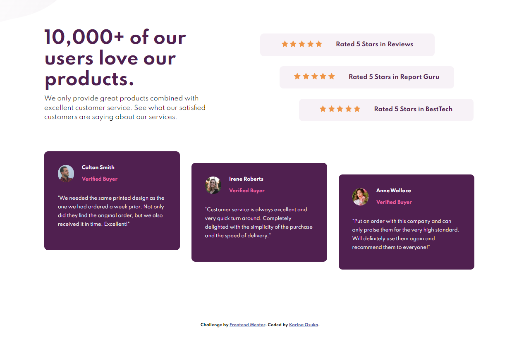

# Frontend Mentor - Social proof section solution

This is a solution to the [Social proof section challenge on Frontend Mentor](https://www.frontendmentor.io/challenges/social-proof-section-6e0qTv_bA). Frontend Mentor challenges help you improve your coding skills by building realistic projects.
rview

### The challenge

Users should be able to:

- View the optimal layout for the section depending on their device's screen size

### Screenshot

### Links

- Solution URL: [GitHub repository](https://github.com/kari-osk/social-proof-section)
- Live Site URL: [GitHub pages](https://kari-osk.github.io/social-proof-section/)

## My process

### Built with

- Semantic HTML5 markup
- CSS custom properties
- Flexbox
- CSS Grid
- Mobile-first workflow

## Author

- LinkedIn - [Karina Osuka](www.linkedin.com/in/karinaosuka)
- Frontend Mentor - [@kari-osk](https://www.frontendmentor.io/profile/kari-osk)
